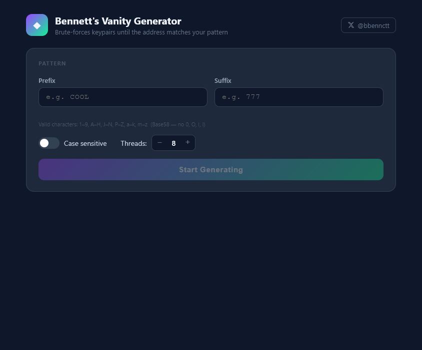
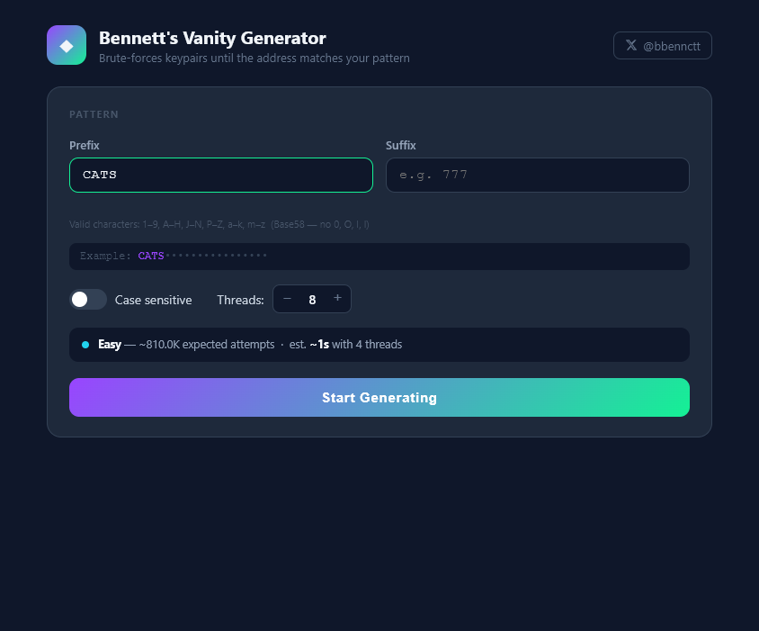
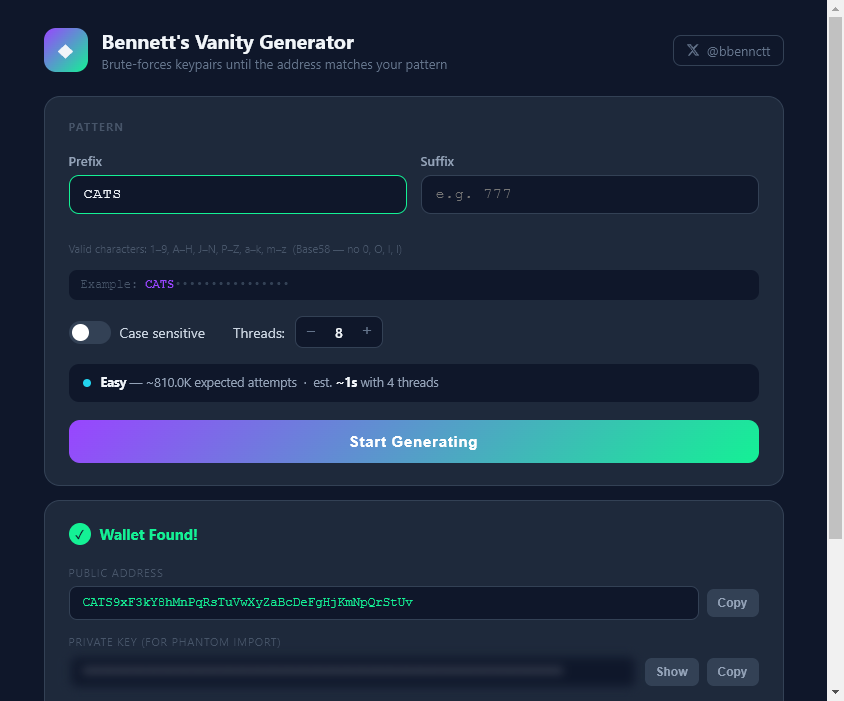

# Bennett's Vanity Generator

A desktop app for generating Solana vanity wallet addresses. Brute-forces keypairs until the public address matches your chosen prefix and/or suffix.

Built by [@bbennctt](https://twitter.com/bbennctt)

---

## Screenshots





---

## Features

- **Prefix & suffix matching** — find an address that starts with, ends with, or both
- **Case-insensitive mode** — finds results much faster (~30x per character)
- **Multi-threaded** — uses all your CPU cores in parallel
- **Live stats** — real-time attempts/sec and estimated time remaining
- **Difficulty estimate** — shows how hard your pattern is before you start
- **Safe export** — save your keypair as a `.json` file compatible with Phantom and any Solana wallet

---

## Download

Grab the latest release from the [Releases](https://github.com/bbbbennett/bennetts-vanity-generator/releases) page. Extract the zip and run `Bennetts Vanity Generator.exe` — **no install required, no Node.js needed.**

---

## Run from Source

> **Note:** This is only needed if you want to edit the code. If you just want to use the app, download the `.exe` above — it works on its own.

Requires [Node.js](https://nodejs.org) 18+.

```bash
git clone https://github.com/bbbbennett/bennetts-vanity-generator.git
cd bennetts-vanity-generator
npm install
npm start
```

---

## Build

```bash
npm run dist
```

Output goes to `dist/Bennetts Vanity Generator-win32-x64/`.

---

## How It Works

Each worker thread generates random Ed25519 keypairs using [tweetnacl](https://github.com/dchest/tweetnacl-js), encodes the public key as Base58, and checks whether it matches your pattern. The first thread to find a match wins and all threads stop.

Solana addresses use the Base58 alphabet — the characters `0`, `O`, `I`, and `l` are not valid and will be rejected by the input.

**Expected attempts by prefix length:**

| Length | Case Sensitive | Case Insensitive |
|--------|---------------|-----------------|
| 1 | ~58 | ~30 |
| 2 | ~3,400 | ~900 |
| 3 | ~195K | ~27K |
| 4 | ~11M | ~810K |
| 5 | ~656M | ~24M |
| 6 | ~38B | ~729M |

---

## Security

- Keys are generated entirely **locally** — nothing is ever sent over the network
- The private key is blurred by default in the UI
- Always back up your `keypair.json` securely and **never share it with anyone**
